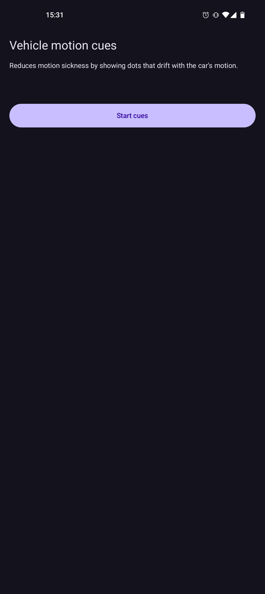
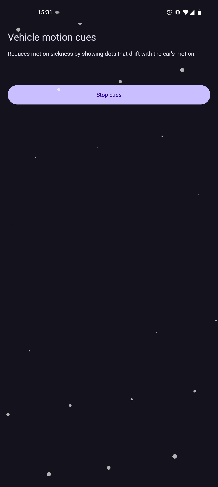

# Motion cues

Motion cues is an Android app that shows an overlay while you use your phone in a car, bus, or train.

You need to activate the overlay yourself, it is not automatic.

It works similarly to vehicle motion cues on iPhone and aims to reduce motion sickness by drawing dots that drift with the vehicle's motion.

## Screenshots

 

## License

This project is licensed under `GPL-3.0-only`.

See [LICENSE](LICENSE) for the full text.
